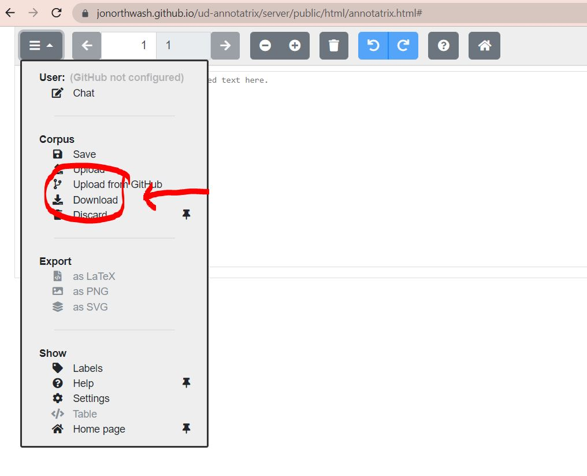

# UD-lenguas-peruanas
## Protocolo de anotación de oraciones para el treebank multiparalelo de lenguas peruanas (cómo ponemos orden al caos :))
1. [Software](https://github.com/jonorthwash/ud-annotatrix) de anotación
<<<<<<< HEAD
    -   **recomendación!** usen todas las versiones del programa que salen en este [link](https://github.com/jonorthwash/ud-annotatrix#remote-static-files)
    -   Para evitar problemas, cada vez que anoten una oración, guárdenla en su computador. Usen el botón de la [figura](imagenes/download.JPG)
=======
    -   **recomendación!** usen todas las versiones del programa que salen en este [link](https://github.com/jonorthwash/ud-annotatrix#remote-static-files). A veces los diferentes programas se caen. 
    -   Para evitar problemas, cada vez que anoten una oración, descarguen la oración usando el botón de la 
2. xxx
